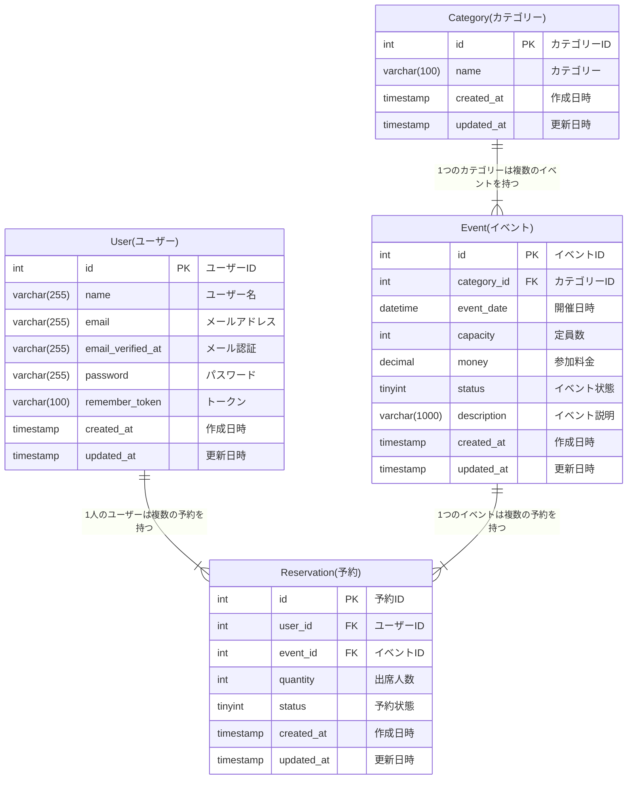

```mermaid
erDiagram
    "User(ユーザー)" ||--|{ "Reservation(予約)": "1人のユーザーは複数の予約を持つ"
    "Category(カテゴリー)" ||--|{ "Event(イベント)": "1つのカテゴリーは複数のイベントを持つ"
    "Event(イベント)" ||--|{ "Reservation(予約)": "1つのイベントは複数の予約を持つ"

    "User(ユーザー)" {
        int id PK "ユーザーID"
        varchar(255) name "ユーザー名"
        varchar(255) email "メールアドレス"
        varchar(255) email_verified_at "メール認証"
        varchar(255) password "パスワード"
        varchar(100) remember_token "トークン"
        timestamp created_at "作成日時"
        timestamp updated_at "更新日時"
    }

    "Category(カテゴリー)" {
        int id PK "カテゴリーID"
        varchar(100) name "カテゴリー"
        timestamp created_at "作成日時"
        timestamp updated_at "更新日時"
    }

    "Event(イベント)" {
        int id PK "イベントID"
        int category_id FK "カテゴリーID"
        datetime event_date "開催日時"
        int capacity "定員数"
        decimal money "参加料金"
        tinyint status "イベント状態"
        varchar(1000) description "イベント説明"
        timestamp created_at "作成日時"
        timestamp updated_at "更新日時"
    }

    "Reservation(予約)" {
        int id PK "予約ID"
        int user_id FK "ユーザーID"
        int event_id FK "イベントID"
        int quantity "出席人数"
        tinyint status "予約状態"
        timestamp created_at "作成日時"
        timestamp updated_at "更新日時"
    }
```