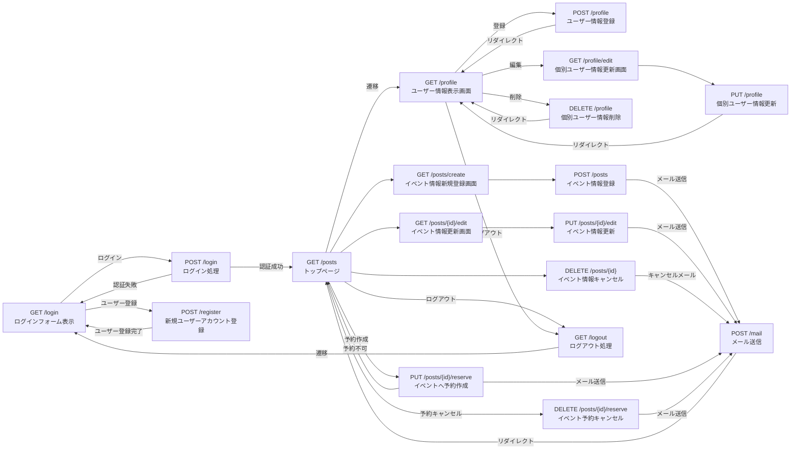

```mermaid
flowchart LR
    LOGIN_G["GET /login<br/>ログインフォーム表示"] -->|ログイン| LOGIN_P["POST /login<br/>ログイン処理"]
    LOGIN_G --> |ユーザー登録| REGISTER_P["POST /register<br/>新規ユーザーアカウント登録"]
    REGISTER_P --> |ユーザー登録完了| LOGIN_G
    LOGIN_P --> |認証成功| TOP_G["GET /posts<br/>トップページ"]
    LOGIN_P --> |認証失敗| LOGIN_G
    TOP_G --> |遷移| PROFILE_G["GET /profile<br/>ユーザー情報表示画面"]
    PROFILE_G --> |登録| PROFILE_P["POST /profile<br/>ユーザー情報登録"]
    PROFILE_G --> |編集| PROFILE_EDIT_G["GET /profile/edit<br/>個別ユーザー情報更新画面"]
    PROFILE_EDIT_G --> PROFILE_PU["PUT /profile<br/>個別ユーザー情報更新"]
    PROFILE_G --> |削除| PROFILE_D["DELETE /profile<br/>個別ユーザー情報削除"]
    PROFILE_P --> |リダイレクト| PROFILE_G
    PROFILE_PU --> |リダイレクト| PROFILE_G
    PROFILE_D --> |リダイレクト| PROFILE_G
    TOP_G --> POST_REGISTER_C["GET /posts/create<br/>イベント情報新規登録画面"]
    POST_REGISTER_C --> POST_P["POST /posts<br/>イベント情報登録"]
    TOP_G --> POST_EDIT_G["GET /posts/{id}/edit<br/>イベント情報更新画面"]
    POST_EDIT_G--> POST_EDIT_PU["PUT /posts/{id}/edit<br/>イベント情報更新"]
    TOP_G --> POST_D["DELETE  /posts/{id}<br/>イベント情報キャンセル"]
    POST_P --> |メール送信| MAIL_P["POST /mail<br/>メール送信"]
    POST_EDIT_PU --> |メール送信| MAIL_P
    MAIL_P --> |リダイレクト|TOP_G
    POST_D --> |キャンセルメール| MAIL_P
    TOP_G --> |予約作成|　POST_RESERVE_PU["PUT /posts/{id}/reserve<br/>イベントへ予約作成"]
    POST_RESERVE_PU --> |予約不可|TOP_G
    POST_RESERVE_PU --> |メール送信| MAIL_P
    TOP_G --> |予約キャンセル|　POST_RESERVE_D["DELETE /posts/{id}/reserve<br/>イベント予約キャンセル"]
    POST_RESERVE_D　--> |メール送信| MAIL_P
    TOP_G --> |ログアウト|LOGOUT_G["GET /logout<br/>ログアウト処理"]
    PROFILE_G --> |ログアウト|LOGOUT_G
    LOGOUT_G --> |遷移|LOGIN_G
```